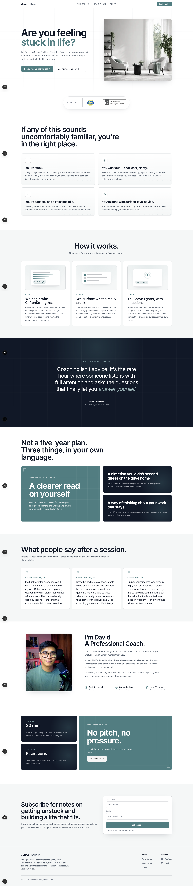

# Life Coach Landing Page — Redesign Proof of Concept

A speculative redesign of a life-coaching landing page, built as a proof of concept.
The goal was to take an existing site and reimagine it as a modern, conversion-focused
landing page with a cohesive design system, motion, and a clear narrative flow.

- **Original site:** [dabsestillore.com](https://dabsestillore.com/)
- **Status:** Proof of concept / design exploration — not affiliated with or endorsed by the original.

## Before / After

Full-page captures of the original site and the redesign, side by side:

| Before | After |
| --- | --- |
|  |  |

## The redesign

The new landing page is composed of focused sections, each in
`src/features/landing/sections/`:

| Section | What it does |
| --- | --- |
| `Nav` | Sticky top navigation |
| `Hero` | Headline, value proposition, primary CTA |
| `Certifications` | Trust signals (Transformation Academy, Gallup Strengths) |
| `WhoItsFor` | "If any of this sounds familiar…" qualifier cards |
| `HowItWorks` | Three-step process with illustrative mocks |
| `PullQuote` | Dark editorial break |
| `Outcomes` | Bento grid of what clients walk away with |
| `Testimonials` | Real, lightly-edited client quotes |
| `About` | The coach's story |
| `Newsletter` | Email capture |
| `Cta` | Closing booking call to action |
| `SiteFooter` | Footer |

### Design system

- A single teal hue family (`--green` and its tints) drives the whole palette,
  defined as CSS variables in `app/globals.css`.
- Shared atmospheric textures (masked grids, topographic contours, dot fields) and
  scroll/hover motion helpers live in `src/features/landing/reveal.ts`.
- Reusable card/tile treatments are centralized in `src/features/landing/bento.tsx`.
- Cards reveal on scroll and gently lift on hover (no clickable-looking border state).

## Tech stack

- [Next.js 16](https://nextjs.org) (App Router) + React 19
- [Tailwind CSS v4](https://tailwindcss.com)
- [Motion](https://motion.dev) for scroll reveals and micro-interactions
- [shadcn/ui](https://ui.shadcn.com) + Radix primitives
- TypeScript

## Getting started

```bash
pnpm install
pnpm dev
```

Open [http://localhost:3000](http://localhost:3000) to view it.

Other scripts:

```bash
pnpm build   # production build
pnpm start   # serve the production build
pnpm lint    # eslint
```
